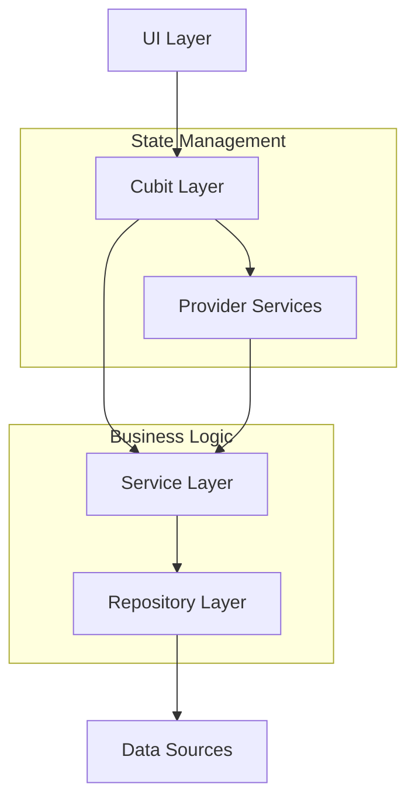
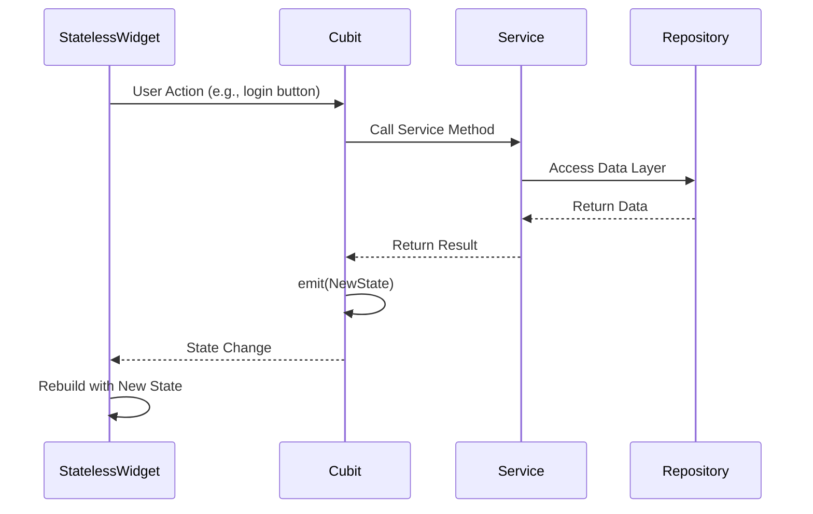

# Flutter Heart Rate Monitor - Project Documentation

## 🏥 Project Overview

The Flutter Heart Rate Monitor is an IoT-enabled mobile application that connects to ESP8266-based heart rate monitoring devices. The app allows users to track their heart rate in real-time, manage running sessions, and store historical data.

### Key Features
- **Real-time Heart Rate Monitoring** via MQTT
- **ESP8266 Device Configuration** through QR codes and UART
- **Run Tracking** with distance and heart rate data
- **User Authentication** with secure credential storage
- **Profile Management** for personalized experience
- **Cross-platform Support** (iOS, Android, Windows, macOS, Linux)

## 🏗️ Architecture Overview

### State Management Pattern
The application uses a **hybrid architecture** combining:
- **Cubit (BLoC Pattern)** for UI state management
- **Provider Pattern** for services and dependency injection



### Project Structure
```
lib/
├── cubits/              # State management (Cubit pattern)
├── models/              # Data models
├── navigation/          # Route management
├── repositories/        # Data access layer
│   └── interfaces/      # Repository contracts
├── screens/             # Main app screens
├── services/            # Business logic services
│   └── interfaces/      # Service contracts
├── theme/               # UI theme configuration
└── widgets/             # Reusable UI components
    ├── dialogs/         # Modal dialogs
    ├── heart_rate/      # Heart rate specific widgets
    ├── main_screen/     # Main screen components
    ├── microcontroller/ # Device configuration widgets
    ├── profile/         # Profile management widgets
    ├── qr_scanner/      # QR code scanning widgets
    └── run_list_item/   # Run history components
```

## 🔄 StatefulWidget to StatelessWidget Conversion

### Motivation
The original codebase contained large StatefulWidgets (400+ lines) mixing UI rendering with business logic, leading to:
- **Poor maintainability** - Complex state management
- **Testing difficulties** - Tightly coupled code
- **Performance issues** - Unnecessary rebuilds
- **Code duplication** - Repeated patterns across screens

### Conversion Strategy

#### 1. State Management Migration
**Before (StatefulWidget)**:
```dart
class MicrocontrollerScreen extends StatefulWidget {
  // 493 lines of mixed UI and business logic
  bool _isConfigured = false;
  String? _storedUsername;
  
  void _loadConfiguration() {
    // Business logic mixed with UI
    setState(() {
      _isConfigured = true;
    });
  }
}
```

**After (StatelessWidget + Cubit)**:
```dart
class MicrocontrollerScreen extends StatelessWidget {
  // 132 lines - pure UI rendering
  @override
  Widget build(BuildContext context) {
    return BlocConsumer<MicrocontrollerCubit, MicrocontrollerState>(
      listener: (context, state) { /* Handle side effects */ },
      builder: (context, state) { /* Render UI based on state */ },
    );
  }
}

// Business logic extracted to Cubit
class MicrocontrollerCubit extends Cubit<MicrocontrollerState> {
  void initialize() {
    // Pure business logic
    emit(MicrocontrollerLoaded(isConfigured: true));
  }
}
```

#### 2. Component Extraction
Large widgets were broken down into smaller, focused components:

**Example: QR Scanner Screen Decomposition**
```dart
// Original: 483 lines in single file
QRScannerScreen extends StatefulWidget

// Converted to: 114 lines + 4 components
QRScannerScreen extends StatelessWidget
├── QRScannerOverlay (89 lines)
├── ScannerInstructions (45 lines)
├── ProcessingIndicator (32 lines)
└── SerialConfigDialog (98 lines)
```

### Conversion Results

| Screen | Original | Final | Components Created | Reduction |
|--------|----------|-------|-------------------|-----------|
| MicrocontrollerScreen | 493 → 132 | 5 components | 73% |
| QRScannerScreen | 483 → 114 | 4 components | 76% |
| MainScreen | 351 → 95 | 6 components | 73% |
| HeartRateDashboardScreen | 264 → 158 | 4 components | 40% |
| LoginScreen | 248 → 107 | 2 components | 57% |
| ProfileScreen | 238 → 101 | 3 components | 58% |
| RegistrationScreen | 183 → 57 | 1 component | 69% |

**Total: 2,260 → 764 lines (66% reduction)**

## 🧩 Component Architecture

### Design Principles
1. **Single Responsibility** - Each component has one clear purpose
2. **Composition over Inheritance** - Build complex UIs from simple parts
3. **Reusability** - Components can be used across multiple screens
4. **Testability** - Small components are easier to test

### Component Examples

#### 1. Status Cards (Microcontroller)
```dart
// Split large status display into focused components
ConfigurationStatusCard()    // Shows device config status
SerialNumberCard()          // Displays serial number info
ErrorCard()                 // Shows error states
```

#### 2. Form Components
```dart
// Reusable form components across screens
LoginForm()                 // Login functionality
RegistrationForm()          // User registration
EditProfileForm()           // Profile editing
RunInputSection()           // Distance input for runs
```

#### 3. Heart Rate Components
```dart
// Heart rate monitoring UI components
ConnectivityStatusBanner()  // Shows connection status
ConnectionStatusCard()      // Device connection info
HeartRateDisplayCard()     // Real-time heart rate
ActionButtons()            // Connect/disconnect actions
```

## 📱 Screen Architecture

### StatelessWidget Pattern
All major screens now follow this pattern:

```dart
class ExampleScreen extends StatelessWidget {
  @override
  Widget build(BuildContext context) {
    return Scaffold(
      appBar: ExampleAppBar(),
      body: BlocConsumer<ExampleCubit, ExampleState>(
        listener: (context, state) {
          // Handle side effects (navigation, snackbars, etc.)
        },
        builder: (context, state) {
          return Column(
            children: [
              ExampleHeader(),
              ExampleContent(state: state),
              ExampleActions(),
            ],
          );
        },
      ),
    );
  }
}
```

### State Management Flow


## 🔧 State Management Details

### Cubit Implementation
Each screen has its corresponding Cubit for state management:

```dart
// Authentication State Management
class AuthCubit extends Cubit<AuthState> {
  final AuthProviderInterface _authProvider;
  
  AuthCubit(this._authProvider) : super(AuthInitial());
  
  Future<void> login(String email, String password) async {
    emit(AuthLoading());
    try {
      final success = await _authProvider.login(email, password);
      if (success) {
        emit(AuthSuccess());
      } else {
        emit(AuthError('Invalid credentials'));
      }
    } catch (e) {
      emit(AuthError('Login failed: $e'));
    }
  }
}
```

### State Classes
Each Cubit defines clear state classes:

```dart
abstract class AuthState extends Equatable {
  const AuthState();
  @override
  List<Object?> get props => [];
}

class AuthInitial extends AuthState {}
class AuthLoading extends AuthState {}
class AuthSuccess extends AuthState {}
class AuthError extends AuthState {
  final String message;
  const AuthError(this.message);
  @override
  List<Object?> get props => [message];
}
```

## 🛡️ Remaining StatefulWidgets

### Intentionally Preserved
Some widgets remain as StatefulWidget following Flutter best practices:

#### Form Input Components
```dart
// TextEditingController management requires StatefulWidget
class LoginForm extends StatefulWidget {
  final TextEditingController _emailController = TextEditingController();
  final TextEditingController _passwordController = TextEditingController();
  
  @override
  void dispose() {
    _emailController.dispose();
    _passwordController.dispose();
    super.dispose();
  }
}
```

#### Why These Remain StatefulWidget:
1. **TextEditingController Management** - Requires proper disposal
2. **Form Validation** - Local validation state
3. **Focus Management** - Keyboard and focus handling
4. **Performance** - Avoiding unnecessary parent rebuilds

## 📊 Performance Improvements

### Before Conversion
- **Full screen rebuilds** on state changes
- **Mixed business logic** causing unnecessary computations
- **Large widget trees** affecting rendering performance

### After Conversion
- **Targeted rebuilds** with BlocBuilder
- **Separated business logic** in Cubits
- **Smaller component trees** for efficient rendering

### Metrics
```dart
// Example: MainScreen rebuild optimization
// Before: Entire screen rebuilds on distance change
// After: Only RunInputSection rebuilds

BlocBuilder<MainScreenCubit, MainScreenState>(
  buildWhen: (previous, current) => 
    previous.runName != current.runName, // Precise rebuild condition
  builder: (context, state) => RunInputSection(),
)
```

## 🧪 Testing Strategy

### Unit Testing (Cubits)
```dart
blocTest<AuthCubit, AuthState>(
  'emits [AuthLoading, AuthSuccess] when login succeeds',
  build: () => AuthCubit(mockAuthProvider),
  act: (cubit) => cubit.login('test@email.com', 'password'),
  expect: () => [AuthLoading(), AuthSuccess()],
);
```

### Widget Testing (Components)
```dart
testWidgets('LoginForm validates empty fields', (tester) async {
  await tester.pumpWidget(TestWidget(child: LoginForm()));
  
  await tester.tap(find.byType(ElevatedButton));
  await tester.pump();
  
  expect(find.text('Email is required'), findsOneWidget);
});
```

## 🔐 Security Features

### Secure Storage
```dart
class SecureStorageService {
  final FlutterSecureStorage _storage = FlutterSecureStorage();
  
  Future<void> saveUserCredentials(String email, String password) async {
    await _storage.write(key: 'user_email', value: email);
    await _storage.write(key: 'user_password', value: password);
  }
}
```

### Authentication Flow
1. **Login credentials** stored securely
2. **Auto-login** on app restart
3. **Session management** with timeout
4. **Secure logout** clearing all data

## 🌐 IoT Integration

### MQTT Communication
```dart
class MqttService extends ChangeNotifier {
  MqttServerClient? _client;
  
  Future<void> connect() async {
    _client = MqttServerClient.withPort(
      'broker.hivemq.com', 
      'flutter_client_${DateTime.now().millisecondsSinceEpoch}',
      1883,
    );
    
    await _client!.connect();
    _subscribeToHeartRate();
  }
  
  void _subscribeToHeartRate() {
    _client!.subscribe('heart_rate/monitor', MqttQos.atMostOnce);
    _client!.updates!.listen(_onHeartRateUpdate);
  }
}
```

### ESP8266 Configuration
```dart
class UartService {
  SerialPort? _port;
  
  Future<bool> connect() async {
    final ports = SerialPort.availablePorts;
    for (final portName in ports) {
      _port = SerialPort(portName);
      if (await _port!.openReadWrite()) {
        return true;
      }
    }
    return false;
  }
  
  Future<void> sendConfiguration(Map<String, dynamic> config) async {
    final jsonData = jsonEncode(config);
    await _port!.write(Uint8List.fromList(utf8.encode('$jsonData\n')));
  }
}
```

## 🚀 Deployment & Platforms

### Supported Platforms
- **Android** (API 21+)
- **iOS** (iOS 12.0+)
- **Windows** (Windows 10+)
- **macOS** (macOS 10.14+)
- **Linux** (Ubuntu 18.04+)

### Build Configuration
```yaml
# pubspec.yaml
flutter:
  platforms:
    android:
      minSdkVersion: 21
    ios:
      ios_deployment_target: '12.0'
    windows:
      cmake_minimum_required_version: '3.14'
    macos:
      macos_deployment_target: '10.14'
    linux:
      cmake_minimum_required_version: '3.10'
```

## 📈 Future Enhancements

### Planned Features
1. **Data Analytics** - Heart rate trends and insights
2. **Cloud Sync** - Multi-device data synchronization
3. **Wearable Integration** - Apple Watch/WearOS support
4. **Social Features** - Share achievements and compete
5. **Advanced Monitoring** - Sleep tracking, stress levels

### Technical Improvements
1. **Offline Mode** - Local data storage and sync
2. **Background Processing** - Continuous monitoring
3. **Push Notifications** - Alerts and reminders
4. **Advanced Testing** - Integration and E2E tests
5. **Performance Monitoring** - Crash reporting and analytics

## 🔧 Development Setup

### Prerequisites
```bash
flutter --version  # Flutter 3.x required
dart --version     # Dart 3.x required
```

### Installation
```bash
git clone <repository-url>
cd flutter-heart-rate-monitor
flutter pub get
flutter run
```

### Hardware Requirements
- **ESP8266** development board
- **Heart rate sensor** (MAX30102 or similar)
- **MQTT broker** access
- **USB cable** for device configuration

## 📝 Conclusion

The Flutter Heart Rate Monitor project successfully demonstrates modern mobile development practices with clean architecture, efficient state management, and comprehensive IoT integration. The conversion from StatefulWidget to StatelessWidget has resulted in a more maintainable, testable, and performant codebase while preserving all functionality.

The project serves as an excellent foundation for further development and can be easily extended with additional features and integrations. 